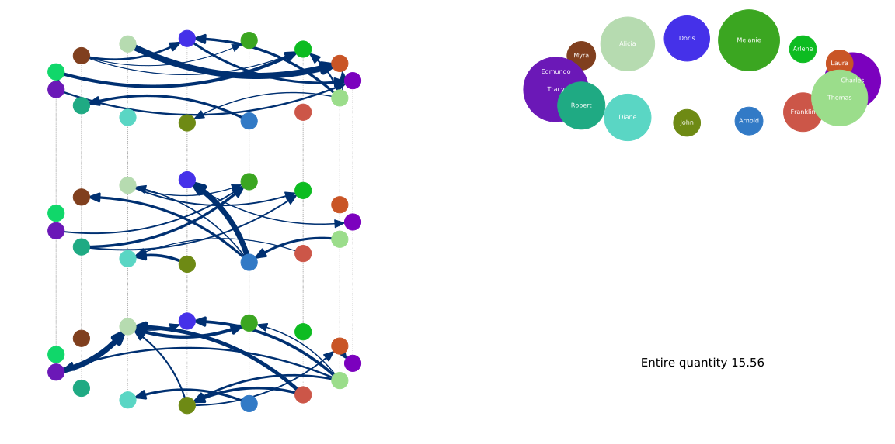

# Co-Evolving Multilayer Network

This code generates a co-evolving multilayer network, that is, a network with multiple types of interactions between the nodes, while both the state of the nodes and the links that connect the nodes evolve dynamically.

Created with Python 3.7
Dependencies:
- matplotlib 3.2.1
- numpy 1.18.4
- networkx 2.4
- names 0.3.0
