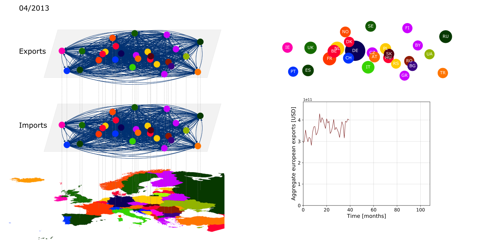

# Co-Evolving Multilayer Network

This code generates a co-evolving multilayer network, that is, a network with multiple types of interactions between the nodes, while both the state of the nodes and the links that connect the nodes evolve dynamically.

# Application Example: European Economic System

This framework can be used to describe a system in which particular entities, in this case European countries, interact with each other in several ways (thus the layers), to exchange, consume, or produce some quantity in a collective manner.
Generally speaking, the dynamic width of the links in the multilayer network on the left depicts the strength of the interaction between the respective countries. The dynamic size of the nodes in the top right depicts the amount of accumulated quantity for each country. 
The plot in the bottom right shows the temporal evolution of the aggregate quantity of all countries combined.

In the following, the model is calibrated to trade data of several European countries between 2010 and 2020, obtained from the [UN Comtrade database](https://comtrade.un.org/data/doc/api/). The width of a link is proportional to the size of the trade between the two countries, while the dynamic node size in the top right reflects the aggregate exports of a country in the respective year and month depicted in the top left.
The code allows for various specifications. For instance, in the following snapshot, the temporal evolution of only the imports and exports that exceed 500 mio. USD and involve the countries Germany, France, and the UK is shown.

The temporal evolution of all trades involving Germany:

And eventually the congested aggregate visualization of all available trades:

As of now, this example merely offers a more attractive visualization of international trade sizes than staring at the numbers. As a direct next step, the framework may be used to visualize more complex metrics, like the net difference in trade relations between two countries. In addition, the current system may be extended by additional layers of interaction along the lines of political and social relations, ultimately enabling the computation of a metric based on the strength of cultural, political, and economic interactions for each set of two countries.

Created with Python 3.7

Dependencies:
- matplotlib 3.2.1
- numpy 1.18.4
- networkx 2.4
- names 0.3.0
